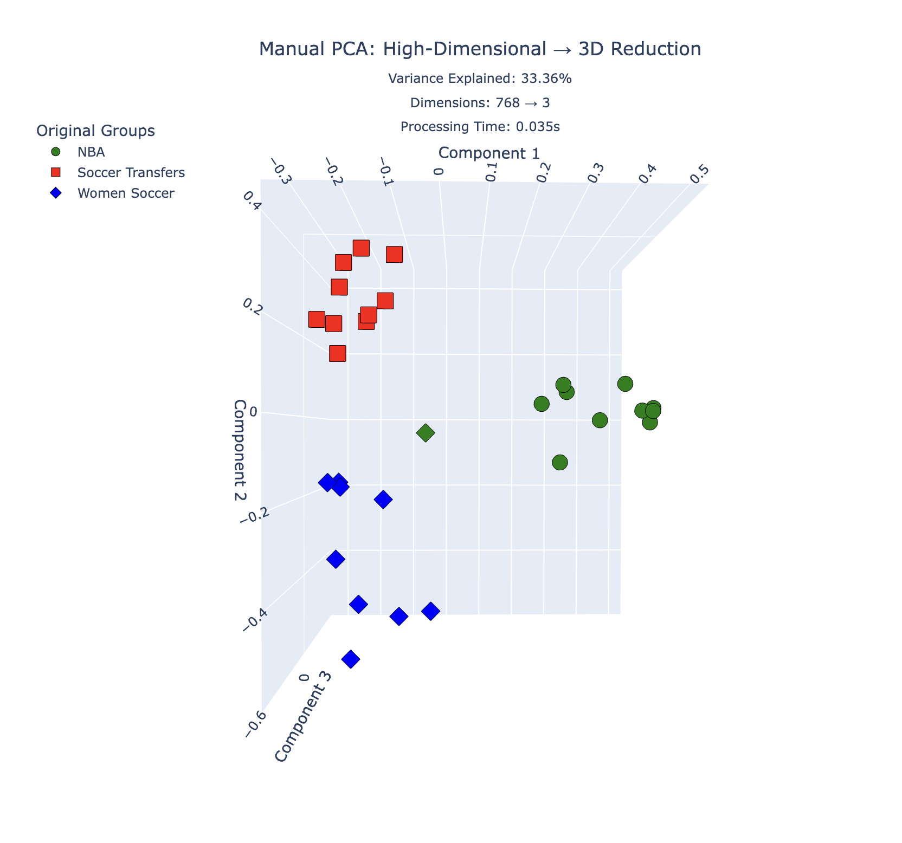
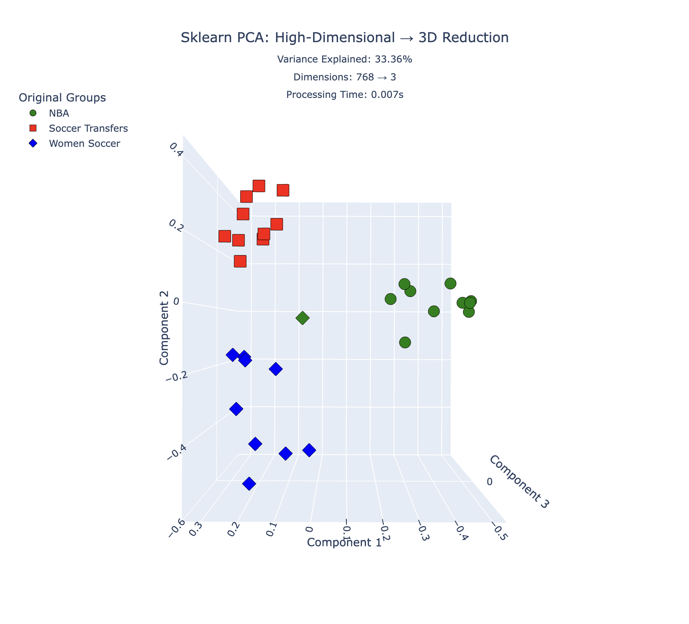
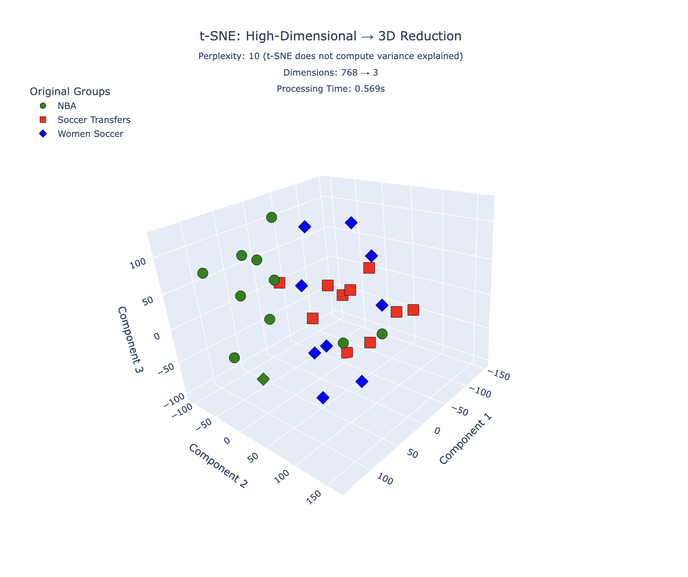

# Title Embedding, Clustering & 3D Visualization Toolkit

This project processes a CSV of content titles (`title`, `group`) to generate embeddings using Google's Gemini API, clusters them with K-Means (k=3), and creates three types of 3D visualizations for analysis.

## File Structure
```text
.
├── README.md                         # Project overview and usage instructions
├── embeddings_clustering_prd.md      # Product requirements document
├── requirements.txt                  # Python dependencies
├── pipeline_input/                   # Input data files
│   └── TitlesforL16HomeWork.csv      # Sample input file
├── config/
│   └── embedding.example.json        # Sample config (copy to embedding.json for local secrets)
├── pipeline_output/                  # Generated artifacts (after running the pipeline)
│   ├── embeddings.parquet
│   ├── embeddings.manifest.json
│   ├── clustering_results.csv
│   ├── kmeans_report.md
│   ├── centroids.json
│   └── visualizations/               # 3D visualization outputs
│       ├── manual_pca_3d.html
│       ├── sklearn_pca_3d.html
│       └── tsne_3d.html
├── utils/                            # Utility modules
│   ├── embedding.py                  # Gemini embedding functions
│   ├── vector_ops.py                 # Vector operations
│   ├── data_io.py                    # Data loading/saving
│   ├── clustering.py                 # K-Means utilities
│   ├── pca_manual.py                 # Manual PCA implementation from scratch
│   └── visualization_3d.py           # 3D plotting with Plotly
├── prepare_embeddings.py             # Step 1: embed & normalize titles
├── run_kmeans.py                     # Step 2: run K-Means (k=3)
├── visualize_3d.py                   # Step 3: generate 3D visualizations
└── run_pipeline.py                   # Orchestrates the full end-to-end flow
```


## Prerequisites
- Python 3.10 or newer
- Recommended: virtual environment (e.g., `python -m venv .venv && source .venv/bin/activate`)
- **Required**: Google Gemini API key (obtain from [Google AI Studio](https://aistudio.google.com/))
- Optional: JSON config file (e.g., `config/embedding.json`) to store model ID and API key

Install dependencies:
```bash
pip install -r requirements.txt
```

Set up your Gemini API key:
```bash
export GEMINI_API_KEY="your-api-key-here"
```
Or configure it in `config/embedding.json` (see below).

## Quick Start (Orchestrated Pipeline)
`run_pipeline.py` ties all scripts together. It prepares embeddings using Gemini, runs K-Means with k=3, and generates three 3D visualizations.

### Using environment variable for API key
```bash
export GEMINI_API_KEY="your-api-key-here"
python run_pipeline.py \
  --input pipeline_input/TitlesforL16HomeWork.csv \
  --output-dir pipeline_output \
  --format parquet
```

### Using config file
Populate `config/embedding.json` (copied from `config/embedding.example.json`) with:
```json
{
  "gemini_model": "models/text-embedding-004",
  "gemini_api_key": "YOUR_KEY_HERE"
}
```
Then run:
```bash
python run_pipeline.py \
  --input pipeline_input/TitlesforL16HomeWork.csv \
  --output-dir pipeline_output \
  --format parquet \
  --config config/embedding.json
```

### Optional parameters
- `--perplexity 10` - t-SNE perplexity (default: 10)
- `--gemini-model models/text-embedding-004` - specify Gemini embedding model
- `--log-level debug` - set logging verbosity

Outputs (within `pipeline_output/` by default):
- `embeddings.parquet` (or `.csv`) and `embeddings.manifest.json`
- `clustering_results.csv` - detailed cluster assignments for each title
- `kmeans_report.md` - clustering metrics and summary
- `centroids.json` - cluster centroids for reference
- `visualizations/` - directory containing:
  - `manual_pca_3d.html` - 3D visualization using manual PCA implementation
  - `sklearn_pca_3d.html` - 3D visualization using sklearn PCA (for validation)
  - `tsne_3d.html` - 3D visualization using t-SNE


## Workflow Overview
```text
Source CSV (title, group)
      │
      ▼
prepare_embeddings.py
      │  └─ outputs embeddings.parquet + embeddings.manifest.json
      ▼
run_kmeans.py (k=3 hardcoded)
      │  ├─ clustering_results.csv
      │  ├─ kmeans_report.md
      │  └─ centroids.json
      ▼
visualize_3d.py
      └─ visualizations/
          ├─ manual_pca_3d.html
          ├─ sklearn_pca_3d.html
          └─ tsne_3d.html
```

## Why Dimensionality Reduction?

When working with high-dimensional data (like our 768-dimensional Gemini embeddings), direct visualization is impossible. Dimensionality reduction techniques compress this data into 2D or 3D space while preserving important structural information, enabling:

- **Visual inspection** of cluster separation and quality
- **Pattern discovery** in data distribution and relationships
- **Outlier detection** through visual examination
- **Validation** of clustering results against original groups
- **Intuitive understanding** of complex high-dimensional relationships

This project uses **3D visualizations** rather than 2D to retain more information while remaining visually interpretable.

## PCA vs t-SNE: Comparison

Both PCA and t-SNE reduce dimensionality, but they work differently and excel in different scenarios:

| Aspect | PCA (Principal Component Analysis) | t-SNE (t-Distributed Stochastic Neighbor Embedding) |
|--------|-----------------------------------|-----------------------------------------------------|
| **Type** | Linear transformation | Non-linear transformation |
| **Goal** | Maximize variance preservation | Preserve local neighborhood structure |
| **Speed** | Very fast (milliseconds for small datasets) | Slow (seconds to minutes) |
| **Deterministic** | Yes (same input → same output) | No (random initialization affects results) |
| **Global structure** | Preserves well | May distort |
| **Local structure** | May distort | Preserves well |
| **Distances** | Euclidean distances meaningful | Distances between clusters not meaningful |
| **Interpretability** | Principal components have clear meaning | Components are abstract |
| **Variance explained** | Quantifiable (e.g., 85% variance retained) | Not applicable |
| **Best for** | Understanding overall structure, variance | Revealing clusters and local patterns |
| **Scalability** | Excellent (linear in samples) | Poor (quadratic complexity) |
| **Outliers** | Can dominate principal components | Less sensitive to outliers |
| **Preprocessing** | Benefits from scaling/centering | Robust to scaling |

### When to Use Each Method

**Use PCA when:**
- You need fast, reproducible results
- Global structure is important (e.g., overall data distribution)
- You want to quantify information retention (variance explained)
- You need to transform new data using the same projection
- Interpretability of components matters
- You have very large datasets

**Use t-SNE when:**
- You want to visualize cluster separation clearly
- Local relationships are more important than global structure
- You have computational resources for longer processing
- You're exploring data patterns interactively
- You want to reveal hidden cluster structures
- Outliers shouldn't dominate the visualization

**Why We Use Both:**
This pipeline provides both methods to give complementary views:
- **PCA** shows the global structure and verifies our manual implementation
- **t-SNE** reveals how well K-Means separated the clusters locally

### Results on the Sample Input File
When running the included `pipeline_input/TitlesforL16HomeWork.csv`, both manual and sklearn PCA produced cleaner separation than t-SNE:
- The three original groups occupy largely orthogonal directions in the embedding space, so PCA’s linear projection preserves their spread: the first three principal components capture ~33% of the variance, enough to keep clusters apart in 3D.
- With only a few dozen samples per cluster, t-SNE (perplexity 10) prioritizes very local neighborhoods. That causes small intra-cluster variations to outweigh the broader between-cluster gaps, so points from different clusters may appear intertwined even though K-Means still distinguishes them.
- PCA therefore offers the more interpretable plot for this dataset: it keeps similar titles together while maintaining the global distances that match the K-Means assignments, whereas t-SNE’s emphasis on local structure introduces visual overlap.

## 3D Visualization Details

The pipeline generates three types of interactive 3D visualizations:

### 1. Manual PCA (From Scratch)
- Implementation: Custom PCA using covariance matrix and eigendecomposition
- Process:
  1. Center the data (subtract mean)
  2. Compute covariance matrix
  3. Calculate eigenvalues and eigenvectors
  4. Sort by eigenvalues (descending)
  5. Select top 3 eigenvectors to form transformation matrix
  6. Project data into new 3D coordinate system
- Shows: Variance explained percentage, dimension reduction info
- Color scheme: Red (cluster 0), Blue (cluster 1), Green (cluster 2)
- Shape scheme: Different markers for original groups



### 2. Sklearn PCA (Validation)
- Implementation: Standard sklearn PCA
- Purpose: Validate manual PCA implementation
- Shows same metrics as manual PCA
- Validation report compares:
  - Eigenvalues (tolerance: 1e-6)
  - Variance explained (tolerance: 1e-6)
  - Transformed coordinates (with sign flip tolerance)



### 3. t-SNE
- Implementation: sklearn TSNE with 3 components
- Parameters: perplexity=10 (configurable via `--perplexity`)
- Best for: Revealing local neighborhood structures
- Shows: Dimension reduction info
- Same color and shape scheme as PCA



### Visualization Features
All 3D plots are interactive HTML files with:
- **Colors**: Represent K-Means cluster assignments
  - Red = Cluster 0
  - Blue = Cluster 1
  - Green = Cluster 2
- **Shapes**: Represent original groups from input CSV
  - Different marker symbols for each unique original group
- **Legend**: Explains both color (clusters) and shape (original groups) mapping
- **Hover info**: Shows title, original group, and cluster ID for each point
- **Dimension info**: Original dimensions → 3D reduction
- **Variance explained**: Percentage of variance retained (PCA only)

## Script-by-Script Usage

### 1. Generate Embeddings
```bash
python prepare_embeddings.py \
  --input pipeline_input/TitlesforL16HomeWork.csv \
  --output processed/embeddings \
  --format parquet \
  --config config/embedding.json
```
Key options:
- `--gemini-model` to choose a Gemini embedding model (default: `models/text-embedding-004`)
- `--gemini-api-key` (or `GEMINI_API_KEY` env var) supplies your Gemini API credentials
- `--config` supplies a JSON file with configuration
- `--allow-duplicates` to process duplicate titles
- `--manifest` to override where the JSON manifest is written

### 2. Run K-Means Clustering (k=3)
```bash
python run_kmeans.py \
  --data processed/embeddings.parquet \
  --output processed/clustering_results.csv \
  --report processed/kmeans_report.md \
  --centroids processed/centroids.json
```
**Note**: K-Means is hardcoded to k=3 as per project requirements.

Options:
- `--seed 42` - random seed for reproducibility (default: 42)
- `--manifest` - path to manifest JSON from prepare_embeddings.py

Outputs:
- Record-level assignments (`clustering_results.csv`) listing title, original group, assigned cluster, and distance to centroid
- Aggregate report (Markdown) with cluster sizes, majority groups, mismatch rate, and silhouette score
- Centroid export for reference (`centroids.json`)

### 3. Generate 3D Visualizations
```bash
python visualize_3d.py \
  --data processed/embeddings.parquet \
  --assignments processed/clustering_results.csv \
  --output-dir processed/visualizations \
  --perplexity 10
```
Options:
- `--perplexity` - t-SNE perplexity parameter (default: 10)
- `--log-level` - logging verbosity

Outputs:
- `manual_pca_3d.html` - Manual PCA implementation visualization
- `sklearn_pca_3d.html` - Sklearn PCA visualization (for validation)
- `tsne_3d.html` - t-SNE visualization

## Manual PCA Implementation

The manual PCA implementation in `utils/pca_manual.py` demonstrates:
- Covariance matrix computation from scratch
- Eigenvalue decomposition using NumPy's `eigh`
- Proper sorting and selection of principal components
- Transformation matrix construction
- Variance explained calculation

Validation checks ensure:
- Eigenvalues match sklearn within 1e-6 tolerance
- Variance explained matches sklearn within 1e-6 tolerance
- Transformed coordinates match (accounting for possible sign flips in eigenvectors)

## Notes & Tips
- All scripts accept `--log-level` for verbose logging (`debug`, `info`, etc.)
- Manifests generated by `prepare_embeddings.py` include model metadata and are automatically reused by downstream scripts
- `run_kmeans.py` computes cosine-based silhouette scores when enough samples are available
- For reproducibility, control seeds with `--seed` and run on consistent dependency versions
- **K-Means k value is hardcoded to 3** - this is intentional per project requirements
- Interactive HTML visualizations can be opened in any modern web browser
- Use Plotly's built-in controls to rotate, zoom, and pan the 3D plots
- **Important**: Gemini API usage requires an active API key and is subject to quota limits. Obtain your API key from [Google AI Studio](https://aistudio.google.com/)

## Dependencies
- `numpy>=1.23` - Numerical computing
- `pandas>=1.5` - Data manipulation
- `pyarrow>=11.0` - Parquet file support
- `scikit-learn>=1.2` - K-Means, PCA, t-SNE
- `plotly>=5.14` - Interactive 3D visualizations
- `google-generativeai>=0.5` - Gemini API client
